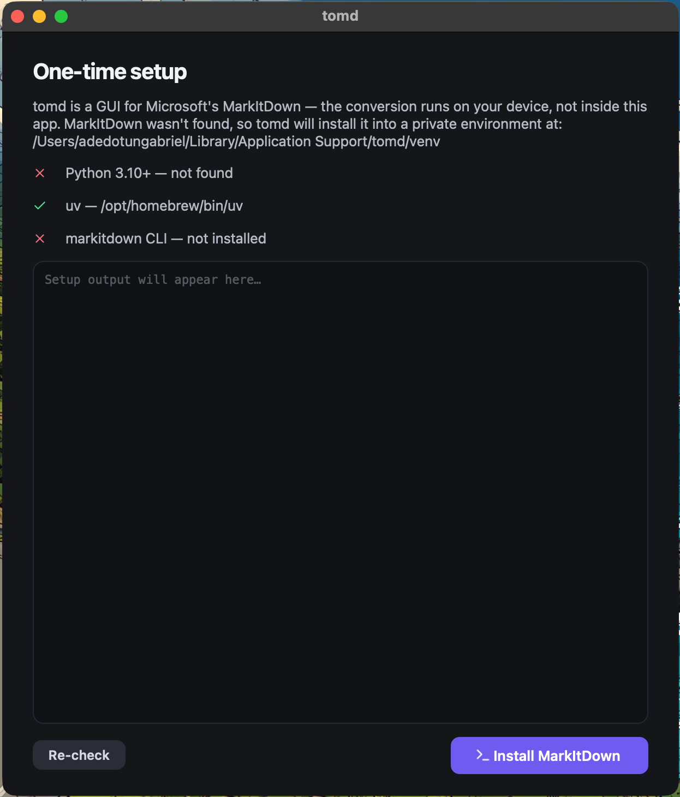
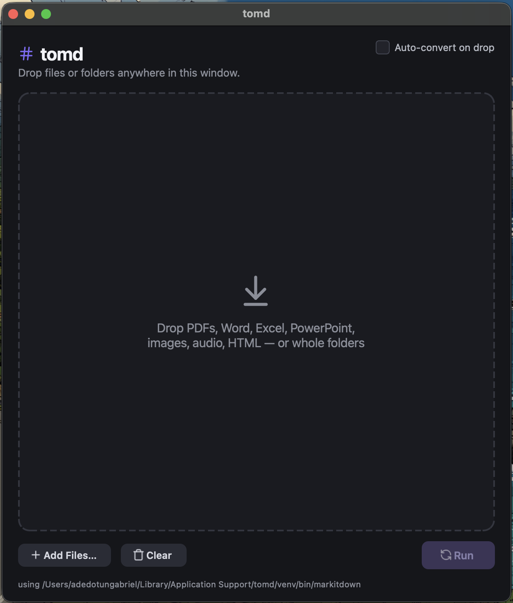
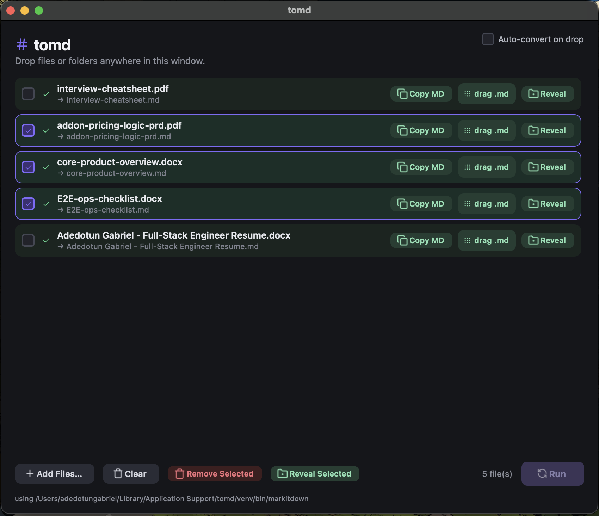
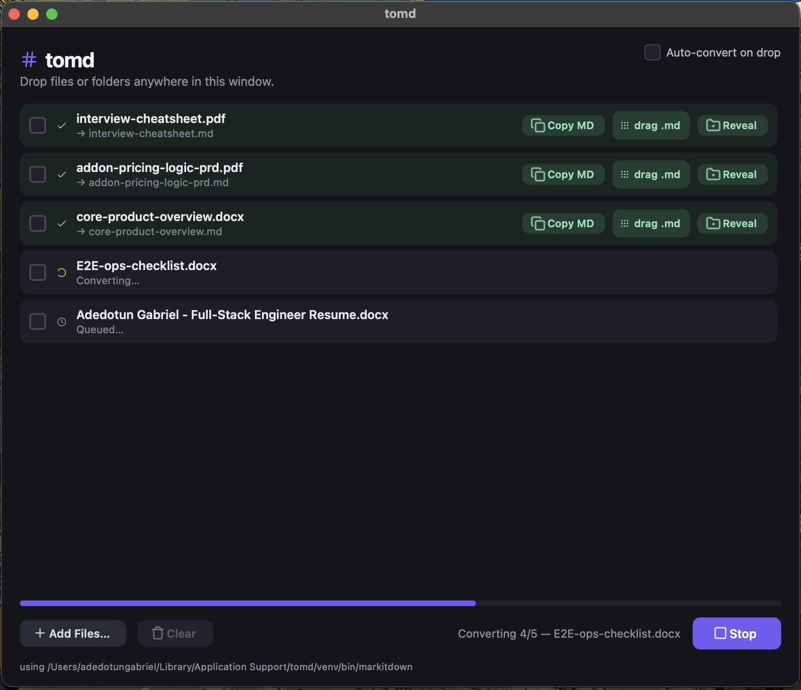
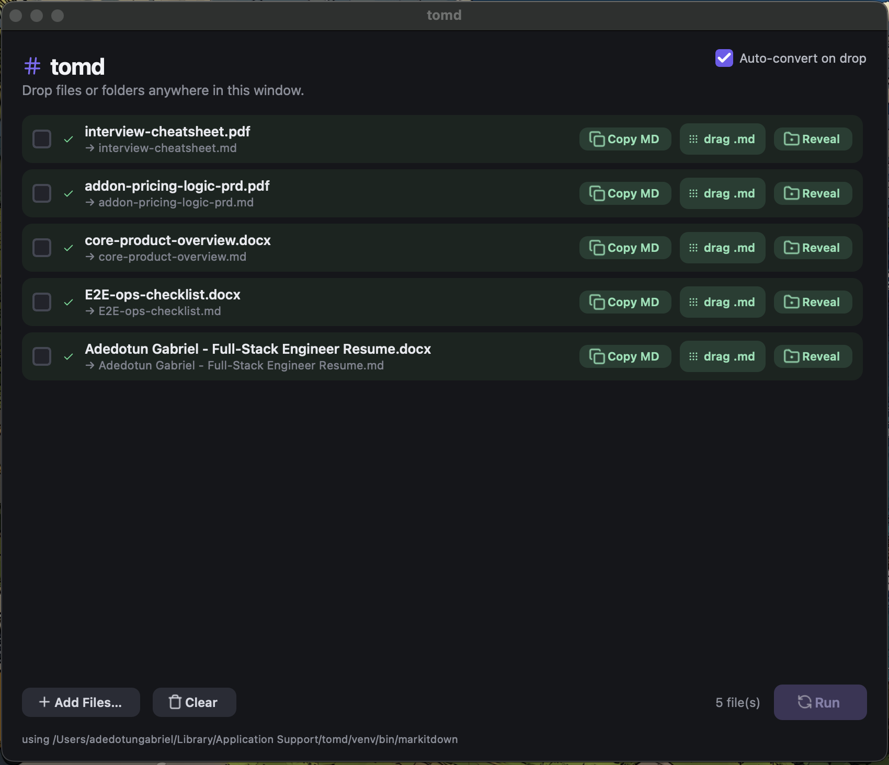

# tomd

[](https://github.com/thekiwidev/tomd/releases/latest)
[](https://github.com/thekiwidev/tomd/actions/workflows/release.yml)
[](https://github.com/thekiwidev/tomd/releases)
[](LICENSE)

**Drag & drop anything. Get Markdown.** · [Website](https://tomd.thekiwidev.me/) · [Download](https://github.com/thekiwidev/tomd/releases/latest)

A thin desktop GUI for [Microsoft MarkItDown](https://github.com/microsoft/markitdown). Drop files or whole folders onto the window and a `.md` file appears next to every source file.

tomd does **no conversion itself** — it runs the `markitdown` CLI on *your* device, exactly as you would in a terminal.

---

## How it works

1. On launch, tomd checks your device for the `markitdown` CLI (your `PATH` first, then tomd's own managed environment).
2. If it's missing, a one-time setup screen installs `markitdown[all]` into a private virtualenv at `~/Library/Application Support/tomd/venv` (macOS) — your global Python is never touched.
3. After that, every conversion is `markitdown <file> -o <file>.md` running in the background, one file at a time.

---

## Walkthrough

### First launch — one-time setup

When you open tomd for the first time, it checks your device for Python 3.10+, [uv](https://docs.astral.sh/uv/), and the `markitdown` CLI. If anything is missing, the setup screen shows exactly what was found and offers a single **Install MarkItDown** button. Click it and tomd handles everything — you won't see this screen again.

> If you already have `markitdown` installed, tomd uses yours and skips setup entirely.



---

### The drop zone

Once set up, you land on the main window. The dashed area is your drop target — drag files or entire folders anywhere onto the window. When your list is empty (or after you clear it), this is what you see.



---

### Auto-convert — single file

With **Auto-convert on drop** enabled, tomd starts converting the moment a file lands. Drop one file, watch it convert — no extra clicks.

<video src="assets/auto-run-single-file.mov" controls width="700"></video>

---

### Auto-convert — multiple files

Same as above, but with a batch. Drop a folder or several files at once and tomd queues and converts them all automatically, one after another.

<video src="assets/auto-run-multi-files.mov" controls width="700"></video>

---

### Manual mode — select, remove, and run

With auto-convert off, dropped files sit in the queue as pending. You can click the checkbox on any row to select it, then use **Remove Selected** to trim the list before running. Hit **Run** when you're ready and tomd converts whatever remains.

<video src="assets/auto-run-disabled.mov" controls width="700"></video>

---

### Selecting multiple files

Click the checkbox on the left of any row to select it. Select as many as you like — **Remove Selected** and **Reveal Selected** appear in the toolbar whenever you have an active selection.



---

### Conversion in progress

While a batch is running, each file shows its state — done (green check), converting (spinning indicator), queued (clock) — alongside an overall progress bar. You can hit **Stop** at any time to halt after the current file; queued files go back to pending.



---

### All done

When the batch finishes, every row shows a green check and a toast confirms the count. From here you can **Copy MD** to grab the markdown straight to your clipboard, drag the `.md` chip into Finder, an editor, or Slack, or hit **Reveal** to jump to the file in Finder / Explorer.



---

## Features

- **Drag & drop** files or entire folders (recursively picks up supported files)
- **Auto-convert on drop** (toggleable) — drop and it converts immediately, no clicks
- **Sequential queue** — one conversion at a time, per-file status, animated spinner, overall progress bar
- **Multi-select** — checkbox on every row; remove or reveal a selection in one click
- **Copy MD** — copy converted markdown straight to your clipboard
- **Drag the `.md` out** — drag the result file into Finder, an editor, Slack, anywhere
- **Reveal** — jump to the converted file in Finder / Explorer
- **Stop** — halt the queue after the current file; queued files return to pending
- **Toasts** — success and error notifications on batch completion

---

## Install

Grab the latest build from [Releases](../../releases):

- **macOS** — see below.
- **Windows** — download `tomd.exe` and run it.

### macOS — Gatekeeper workaround

tomd is currently unsigned (no Apple Developer certificate yet), so macOS will block it on first install. Pick either option:

**Option A — remove the quarantine flag before opening the DMG**

```bash
xattr -d com.apple.quarantine ~/Downloads/tomd.dmg
```

Then open the DMG and drag tomd into Applications as normal.

**Option B — allow it after the fact via System Settings**

1. Download `tomd.dmg`, open it, drag **tomd** into **Applications**, and try to open it.
2. macOS will show a "cannot be opened" dialog — click **Done**.
3. Go to **System Settings → Privacy & Security**, scroll down, and click **Open Anyway** next to tomd.
4. Confirm in the follow-up dialog.

Either option is a one-time step — subsequent launches open normally.

---

## Run from source

Requires [uv](https://docs.astral.sh/uv/).

```bash
git clone https://github.com/thekiwidev/tomd.git
cd tomd
uv sync
uv run python app.py
```

## Build the app yourself

```bash
# macOS — produces dist/tomd.app and dist/tomd.dmg
bash scripts/build_macos.sh

# Windows — produces dist\tomd.exe
pwsh scripts/build_windows.ps1
```

Tagged pushes (`v*`) build both platforms on GitHub Actions and attach them to a release automatically.

---

## Supported formats

PDF, DOCX/DOC, PPTX/PPT, XLSX/XLS, CSV, JSON, XML, HTML, TXT, RTF, EPUB, MSG/EML, WAV/MP3/M4A, JPG/PNG/WEBP, IPYNB, ZIP — everything [MarkItDown](https://github.com/microsoft/markitdown) handles.

---

## Credits

All conversion is done by [MarkItDown](https://github.com/microsoft/markitdown), an open-source project by Microsoft's AutoGen team. tomd is an independent GUI and is not affiliated with or endorsed by Microsoft.

## License

MIT
